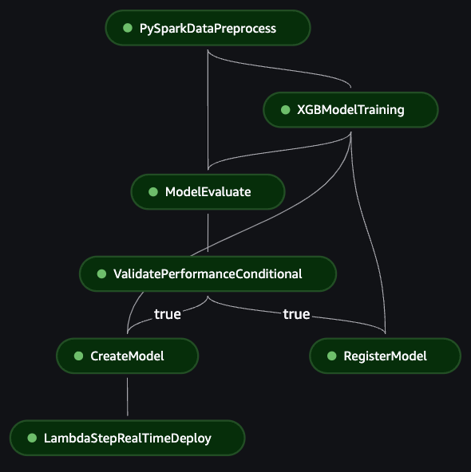
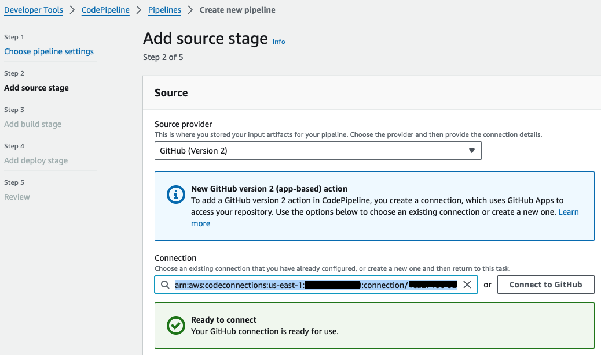

# Credit Fraud Detection — Architecture and Technical Deep-Dive

This document is the architectural and technical reference for an MLOps
engineering case study built around the public, anonymized Kaggle Credit Card
Fraud dataset. It covers the theory behind the design, the design decisions,
the full system architecture, the deployment plan, and the configuration surface.

The implementation is independent personal work, contains no Santander source
code or data, and was never productized by the bank. It was presented during the
author's internal certification process.

For a high-level overview of the project, the technology stack, and the
engineering skills it demonstrates, start from the
[README](README.md).

## Index

1. [Introduction](#1-introduction)
    - [Overview](#overview)
    - [Key Components and Features](#key-components-and-features)
    - [Workflow](#workflow)
2. [Database](#2-database)
    - [About](#about)
    - [Organization](#organization)
    - [Download](#download)
3. [Project Organization](#3-project-organization)
4. [Architecture](#4-architecture)
    - [Technological Justification](#technological-justification)
    - [Architecture Overview](#architecture-overview)
        - [Continuous Integration](#continuous-integration)
        - [Model Pipeline](#model-pipeline)
        - [Models Algorithms](#models-algorithms)
            - [XGBoost](#xgboost)
            - [LightGBM](#lightgbm)
        - [Deployment](#deployment)
        - [Access Management](#access-management)
        - [Storage](#storage)
5. [API Documentation](#5-api-documentation)
    - [Signature](#signature)
    - [Example](#example)
 6. [Implementation Plan](#6-implementation-plan)
    - [Prerequisites](#prerequisites)
    - [Infrastructure From CloudFormation](#infrastructure-from-cloudformation)
    - [Teardown](#teardown)
    - [Debugging](#debugging)
7. [Configuration](#7-configuration)
    - [Parameters](#parameters)
        - [Global](#global)
        - [ECS](#ecs)
        - [Preprocess](#preprocess)
        - [Training](#training)
        - [Evaluation](#evaluation)
        - [Registry](#registry)
        - [Deployment](#deployment-1)
        - [APIGateway](#apigateway)
    - [Environment Variables](#environment-variables)
8. [Future Updates](#8-future-updates)
    - [AWS Account Segregation](#aws-account-segregation)
    - [Unit Tests Full Coverage and Results Exportation](#unit-tests-full-coverage-and-results-exportation)
    - [VPC Isolation](#vpc-isolation)
    - [Implement EKS Replacing or Along With ECS](#implement-eks-replacing-or-along-with-ecs)
    - [AWS Ground Truth](#aws-ground-truth)
    - [Error Alerts](#error-alerts)
    - [Shadow Deployments](#shadow-deployments)
    - [Glacier for Long-Term Storage](#glacier-for-long-term-storage)
    - [Integrate with Grafana or Similar](#integrate-with-grafana-or-similar)
    - [Others](#others)
9. [References](#9-references)

## 1. Introduction

Machine learning algorithms can analyze historical transaction data, identify patterns, and flag anomalies that suggest fraud. Using features such as transaction amount, location, time, merchant details, and customer history, they learn to tell legitimate transactions apart from fraudulent ones.

This document describes an end-to-end Machine Learning Operations (MLOps) project for credit fraud detection. It details the architecture and workflow, which rely on AWS components and, in particular, Amazon SageMaker Pipelines to automate and orchestrate the machine learning workflow.

### Overview

The project leverages Amazon SageMaker Pipelines, CodePipeline, CodeBuild, and API Gateway to automate the workflow from data sourcing to model deployment. It combines continuous integration and delivery (CI/CD), API deployment, and artifact management into a single pipeline.

### Key Components and Features

- Data sourced from Amazon RDS or S3.
- S3 as the primary persistent storage for data and artifacts.
- Model training with XGBoost and LightGBM.
- CI/CD with AWS CodePipeline and CodeBuild, integrated with GitHub.
- Automated unit tests with CodeBuild and PyTest.
- A Docker image that configures and triggers the SageMaker pipeline steps and jobs.
- SageMaker pipeline steps for PySpark preprocessing, training, evaluation, model creation, MLflow registration (including metrics), and deployment.
- Automatic deployment with a canary strategy and AWS Auto Scaling.
- API endpoints deployed through AWS API Gateway.
- Security via scoped AWS IAM roles, a Lambda authorizer backed by Secrets Manager, and API keys with usage plans for metering and throttling.
- Logging and monitoring through AWS CloudWatch.
- Scheduled training via EventBridge Scheduler.

### Workflow

- CI/CD pipeline:
    - Tracks merges to the target branch.
    - AWS CodePipeline automates the integration and deployment process.
    - A Docker image is built to manage the SageMaker pipeline steps.
- Containerized ML job:
    - AWS ECS runs the container on code updates or on a schedule with EventBridge Scheduler.
- Data sourcing and preprocessing:
    - Data is read from Amazon RDS or S3.
    - PySpark (or scikit-learn) cleans and prepares the data for training.
- Model training:
    - Uses XGBoost and LightGBM, automated through SageMaker Pipelines.
- Evaluation and registration:
    - Models are evaluated against predefined metrics.
    - Models below the minimum performance are rejected.
    - Passing models are registered with MLflow, including their metrics.
- Deployment:
    - Models are deployed to SageMaker endpoints with automatic scaling.
    - API endpoints are deployed or updated to interact with the model.

## 2. Database

### About

The dataset consists of features derived from real credit card transactions, anonymized with [Principal Component Analysis (PCA)](#PCA) and available publicly. It was chosen because it is reliable, clean, and appropriately scaled, and because it mirrors the consolidated datasets a data scientist or ML engineer typically builds pipelines over.

### Organization

The dataset features follow this schema:

| Time    | V1    | V2    | ... | V28   | Amount         | Class          |
| ------- | ----- | ----- | --- | ----- | -------------- | -------------- |
| Integer | Float | Float |     | Float | Unsigned Float | Binary Integer |

- Time (int): seconds elapsed between the transaction and the first transaction in the dataset, starting at 0 and ending at 172792. Ordered, positive, and not unique.
- PCA features (Float): columns V1 through V28, the result of the PCA dimensionality reduction, representing the customer's behavior, history, and profile.
- Amount (Unsigned Float): total amount of the operation.
- Class (Binary Integer): the true label, 0 for non-fraud and 1 for fraud.

### Download

The dataset is available directly from the [Kaggle source](#KaggleDataset). After downloading, it must be uploaded to the preferred AWS source, described later in this document.

> [!WARNING]
> The dataset was inserted manually into an equivalent table in an AWS RDS MySQL database. Since this setup is out of scope, its details are not covered here.
>
> For testing, the most approachable source is to upload the data to AWS S3 and set it as the data source.

> [!NOTE]
> A minor correction was applied: a single value in the `Time` column was stored in scientific notation and caused unexpected behavior in some cases. It was replaced with the non-scientific notation.

## 3. Project Organization

This project is developed for AWS Cloud deployment and includes a Python package called `credit-fraud`, responsible for the SageMaker pipeline and its jobs.

- `pyproject.toml`: main Python configuration file for the `credit-fraud` package. Defines package modules, version, dependencies, testing configuration, metadata, and console script commands.
- `setup.py`: used by `pyproject.toml` to install the package.
- `Dockerfile`: instructions for building the Docker image. The entrypoint is the `cf-run` console script, defined in `pyproject.toml` and implemented in `credit_fraud/main.py`.
- `buildspec.yml`: CI build configuration for the container image.
- `testspec.yml`: CI unit-test configuration. Normally managed in a separate repository.
- `.env.example`: example of the environment variables used by the project.
- `config.yml`: project configuration parameters.
- `credit_fraud/`: package source code, including the SageMaker pipeline configuration, job definitions, context functions, and helpers.
- `cloudformation/`: Infrastructure as Code templates, install/uninstall scripts, and Lambda sources.
- `tests/`: unit tests run during the continuous integration phase.
- `models/`: default model parameters, used when environment variables are left undefined.
- `imgs/`: images referenced by this document.
- `VENDORED_DEPENDENCIES.md`: documents the bundled dependencies and the build-time MySQL JDBC driver download.
- `CONTRIBUTING.md` and `LICENSE`: contribution policy and license.

## 4. Architecture

### Technological Justification

Four cloud options were considered, alone or combined: Databricks, AWS, Azure, and GCP. The comparison weighed pricing, scalability, documentation quality, fit with the project requirements, integrations, machine learning capabilities, and hands-on experience. AWS was chosen for this end-to-end MLOps architecture for the following reasons:

1. **Scalability and flexibility**: AWS services scale to large data volumes and workloads. Every integrated component is either horizontally scalable or serverless.
2. **Integration and compatibility**: AWS services are designed to work together, which simplifies development and maintenance and made a multi-cloud setup less attractive.
3. **Security and compliance**: encryption, access control, audit logging, and compliance certifications are available across services.
4. **Monitoring and logging**: CloudWatch enables real-time observability of every component.

The chosen services — SageMaker, ECS, S3, RDS, and others — simplify model development and deployment while providing solid storage, security, and monitoring.

### Architecture Overview


The full architecture is depicted above, omitting minor operations such as data persistence, logging, and component communication for readability. It is organized into three phases: Continuous Integration, Model Pipeline, and Deployment.

#### Continuous Integration

A successful merge into the development branch triggers AWS CodePipeline for a new integration run. The repository is collected with the configuration needed for the run; the pipeline is largely serverless and defined with Infrastructure as Code.

CodeBuild first runs the unit tests defined in `testspec.yml` and configured in the `tool.pytest.ini_options` section of `pyproject.toml`. Results are recorded in a CodeBuild report accessible to authorized users. A failure fails and stops the pipeline immediately. Test coverage is currently low.

Once tests pass, the build phase produces a new container image, again via CodeBuild and configured by `Dockerfile` and `buildspec.yml`. On success, the image is pushed to AWS Elastic Container Registry (ECR), tagged with the project version from `pyproject.toml`. Semantic versioning is the responsibility of the pull request assignees; enforcing it through branch protection and GitHub Actions version checks is out of scope but recommended.

Finally, a Lambda function updates the ECS task definition with the new image URI and triggers the task on the serverless Fargate cluster. This function is defined in `cloudformation/src/lambda/run_pipeline/lambda_run_pipeline.py`.

Outside the CI pipeline, EventBridge Scheduler runs the training daily to keep the model current as new data arrives. The schedule can be adjusted, and new triggers (for example, on new data) can be added.

#### Model Pipeline

The Docker image configures and deploys a SageMaker Pipeline that handles the compute-heavy tasks, such as horizontal data processing and model training. The pipeline is highly customizable through environment variables.



Every run receives a unique `execution_id`, which identifies the run and isolates its scripts, processed data, and artifacts in the S3 bucket.

Preprocessing first launches a cluster that reads and processes the data, splits it into training, validation, and test sets, and saves them under `{execution_id}/processed` in S3. The default framework is PySpark, with scikit-learn also supported. The task scales horizontally and vertically as needed, and Spark configuration is derived automatically from the detected hardware.


Training supports both XGBoost and LightGBM. Using the training and validation sets, the model is trained, evaluated, and its artifacts saved under the run's `execution_id` folder. The run is also logged to an MLflow run with its validation metrics.

A dedicated evaluation step then runs the model on both the validation set and the test set. The validation ROC-AUC drives a conditional gate that accepts or rejects the model before deployment; the test metrics are kept as a final, report-only assessment. When a model is rejected, the create, register, and deploy steps are skipped.

Approved models are registered in MLflow and created in SageMaker as deployable models referencing the container image, artifact URI, and preferred instance resources. Versions can be compared through the MLflow UI.


> [!NOTE]
> [MLflow was recently integrated into SageMaker](#MLFlowSagemaker) and announced during this project's development, so it is not fully supported by every feature. Some workarounds were necessary, such as installing MLflow manually in some containers to avoid rebuilding them.

#### Models Algorithms

##### XGBoost

XGBoost, referenced as `xgb` in the source code, uses the [SageMaker XGBoost framework](#SagemakerXGBoost), which includes training and inference containers. The training script is at `credit_fraud/pipeline/jobs/xgboost/train.py`, and default parameters are in `models/xgboost_default.json`. Parameters can be overridden without rebuilding the image, [using environment variables](#environment-variables).

##### LightGBM

LightGBM, referenced as `lgbm`, uses an edited version of the [SageMaker built-in algorithm](#SagemakerLGBM) with changes for MLflow logging. As with XGBoost, parameters can be overridden. The training files are under `credit_fraud/pipeline/jobs/lgbm`, and default parameters are in `models/lgbm_default.json`.

#### Deployment

Deployment uses AWS Auto Scaling to balance incoming requests, keep the minimum number of SageMaker endpoint instances running and healthy, and scale up under load. Assuming the endpoint stays online, the [canary update strategy](#CanaryUpdate) is used when new models are available, deploying smoothly over the existing structure and only replacing instances once the new endpoints are running and healthy.

When the deployment Lambda runs as the last SageMaker pipeline step, the created model is used to define a new endpoint configuration. The pipeline waits for the update to finish before completing. Endpoints are available internally to authorized users and can be invoked directly for testing or development.

The final two components are the inference Lambda function and the API Gateway, both serverless and highly scalable. The API Gateway routes public requests to the Lambda, forwarding the input body for model assessment. The Lambda adapts the request to the endpoint interface — which may differ between XGBoost and LightGBM — invokes the endpoint, and returns the processed response to the client.

#### Access Management

AWS IAM role-based access authorizes components to perform their operations, and model endpoint access is authenticated with AWS credentials. The CloudFormation-defined roles are purpose-specific, with policies scoped to actions used by the documented workflow and resource ARNs where applicable. They authorize pipeline orchestration, model operations, storage access, and API invocation.

API requests are authenticated by a Lambda authorizer that validates the `Authorization` header against a shared secret stored in AWS Secrets Manager. A separate API key, created automatically with CloudFormation and available in the API Gateway console, is bound to a usage plan that meters and throttles request rate. New keys can be generated as needed.

#### Storage

AWS S3 stores most objects, including metadata and data generated automatically by components. Every pipeline run has its artifacts, input data, processed data, scripts, metrics, and metadata persisted to S3 for reproducibility. The bucket name and directory prefix defined in `.env` are used as the base path.

Container images are registered in Amazon ECR during the build phase and named using the project version. Semantic versioning is expected to be managed during merge requests, manually or with tools such as GitHub Actions.

Finally, component logs are sent to AWS CloudWatch for record and debugging.

## 5. API Documentation

> [!NOTE]
> Once the model is deployed, check the API Gateway stages for the path and the API Keys section for the access key.

### Signature

There are two acceptable requests:

- Health endpoint: checks the health status of the endpoint.
    - Method: GET
    - Parameters: None
    - Authentication: not required
    - Response:
        - Status code: 200 OK
        - Body: true or false, depending on the SageMaker endpoint

- Inference endpoint: makes predictions using the trained model.
    - Method: POST
    - Parameters: data (see example)
    - Authentication: Lambda authorizer (`Authorization` header), plus the API key from the usage plan
    - Response:
        - Status code: 200 OK
        - Body: fraud probability for each transaction

### Example

Example request inferring fraud probability for two transactions:

```
POST <YOUR-API-GATEWAY-URL>/dev
Content-Type: application/json
Authorization: <YOUR_AUTH_TOKEN>
x-api-key: <YOUR_API_KEY>
Body:
{
    "data": {
        "V1": [0.9908107245797958, 0.9948654227271336],
        "V2": [0.7620874261804377, 0.7668768178335329],
        "V3": [0.7745501370133644, 0.730296934431537],
        "V4": [0.2787365158009124, 0.2559981001584685],
        "V5": [0.5366861109059794, 0.5547206276685821],
        "V6": [0.5221665515164394, 0.5091908610110124],
        "V7": [0.5363425771281202, 0.5505183315220422],
        "V8": [0.7844349282724872, 0.7805020554498278],
        "V9": [0.5003672512969346, 0.4728323779941298],
        "V10": [0.5106561411255969, 0.513959798462086],
        "V11": [0.232224015839539, 0.19597500719515368],
        "V12": [0.7052186000334467, 0.6713792910302582],
        "V13": [0.5354840084594876, 0.419861958972384],
        "V14": [0.6471214908091515, 0.6792986090608213],
        "V15": [0.5250732075222956, 0.4857601048665812],
        "V16": [0.7250152410747767, 0.695120063885401],
        "V17": [0.7122896135410216, 0.7179361952915387],
        "V18": [0.6658831759660492, 0.63272129603792],
        "V19": [0.525337201682489, 0.5841998538935199],
        "V20": [0.3880183418307714, 0.3859114064202635],
        "V21": [0.5648802341414124, 0.561756019901421],
        "V22": [0.5398561002540985, 0.5129812181163876],
        "V23": [0.7045099636961798, 0.7016564651059654],
        "V24": [0.42427060805767935, 0.3221463696453801],
        "V25": [0.5600351842164645, 0.5918955170768184],
        "V26": [0.4827201795229411, 0.5518684050789916],
        "V27": [0.6492823211536717, 0.6460197182549959],
        "V28": [0.25623548129770946, 0.2550618026528494],
        "Amount": [0.3676971265150483, -0.109628217349857]
    }
}
Response: [0.0037515881747243, 0.4022510714509944]
```

## 6. Implementation Plan

> [!NOTE]
> The reference deployment was exercised in `us-east-1`. Service availability,
> instance families, quotas, and SDK/container compatibility vary by account and
> region and evolve over time; verify current AWS prerequisites before deploying.

> [!WARNING]
> Not every component is eligible for the AWS Free Tier, and the deployment
> provisions paid resources that keep incurring charges until they are removed.
> The SageMaker endpoint (a minimum of two `ml.m4.xlarge` instances) and its
> auto-scaling configuration are created by the deploy Lambda rather than as
> CloudFormation resources, and the managed MLflow server is provisioned
> outside the stack — so `cloudformation/uninstall.sh` does **not** remove them.
> See [Teardown](#teardown) before deploying.

### Prerequisites

- Bash terminal with AWS CLI configured
    - Requires CloudFormation and IAM role creation access.
- Copy `.env.example` as `.env`.
    - Values must be filled as instructed in the [Environment Variables section](#environment-variables).
- [Configure the SageMaker Domain](#SagemakerDomain).
    - A single-user setup was used for this project's tests.
    - Note the S3 bucket name and write it to `.env`. If the bucket does not appear on this page, check the S3 page. Any bucket can be used.
    - Note the VPC ID and write it to `.env`. A different VPC can be used for better process isolation.
- [Configure the SageMaker MLflow tracking server](#SagemakerMLFlowSetup).
    - Note the server ARN and write it to `.env`.
> [!WARNING]
> The MLflow server is expensive at the moment; turn it off when not in use.
- Create the API authorizer secret in AWS Secrets Manager.
    - Store a JSON string such as `{"api_key": "<YOUR_AUTH_TOKEN>"}` and write
      the secret name to `.env` as `API_KEY_SECRET_NAME`. This token is the
      value sent in the `Authorization` header of inference requests.
- [Connect AWS to GitHub](#AWSGithub).
    - The easiest method is to simulate creating a new CodePipeline and stop at step 2 after connecting to GitHub (version 2). There is no need to finish creating the pipeline.
    - The connection requires a GitHub application associated with the repository.
    - Note the connection ARN and write it to `.env`.
    
- Insert the source data CSV file at the selected source.
    - For S3, the default value is specified in the [environment variables section](#environment-variables).
    - For RDS, create a `credit_fraud` database with a `transactions` table containing the same columns as the original file.
> [!NOTE]
> The S3 source is recommended for simplified tests.

### Infrastructure From CloudFormation

Infrastructure as code is deployed from the templates in the `cloudformation` directory, using configurations from `config.yml` and most of the required environment variables from `.env`.

The script `cloudformation/install.sh` installs the stacks, while `cloudformation/uninstall.sh` removes them. Stacks can also be updated, but that requires specialized intervention.

> [!NOTE]
> `install.sh` issues fixed-name `aws cloudformation create-stack` calls and is
> therefore **not idempotent** — re-running it against an existing stack will
> fail. This reflects a CloudFormation design constraint at the time the project
> was written rather than a deliberate feature; re-installation requires
> removing the stacks first.
>
> This installation was tested on macOS and Ubuntu.
>
> If a stack installation fails, delete all stacks individually. The `storage-stack` does not delete any resource when uninstalled, to avoid data loss; delete it manually if needed to reinstall.

After that, a merge to the tracked branch starts the integration pipeline to process data, train and evaluate a model, and deploy the model endpoint.

### Teardown

To stop incurring charges, remove the resources that `cloudformation/uninstall.sh` does **not** handle, in addition to running that script:

1. Delete the SageMaker endpoint (`CaseCreditFraudPipeline-endpoint`) and its endpoint configuration from the SageMaker console or CLI.
2. Delete the Application Auto Scaling scalable target and scaling policies registered for the endpoint variant.
3. Stop or delete the managed MLflow tracking server (see the SageMaker console).
4. Delete the `storage` stack's retained resources (the `codepipeline-credit-fraud-<account>` S3 bucket and the `credit-fraud-<account>` ECR repository), which use a `Retain` deletion policy.
5. Delete the API authorizer secret created manually in AWS Secrets Manager (the name stored in `API_KEY_SECRET_NAME`).

### Debugging

Most failures can be located on the component dashboards and in more detail on CloudWatch logs:

- CloudFormation installation failures are found on its console, separated by stack.
- Errors in the continuous integration phase are found on the CodePipeline dashboard and its CloudWatch log streams.
- Errors triggering the model pipeline are found on the ECS task dashboard and its CloudWatch log streams.
- Model pipeline failures are found in SageMaker Studio, under the Pipelines section.

## 7. Configuration

### Parameters

The `config.yml` file outlines the settings for the MLOps pipeline, detailing configurations for preprocessing, training, evaluation, and deployment. These settings are used by both the SageMaker pipeline, through the `context` object, and the CloudFormation stack installation. They change infrequently and never hold sensitive values, so they are defined in the image during the build phase.

Every parameter belongs to a parameter group, which is required when referencing it. Exceptionally, `config.yml` is read as environment variables during the CloudFormation installation, and parameters are referenced with the group as a prefix, separated by an underscore. The groups are:

> [!WARNING]
> Many instance types and counts are limited by AWS Service Quota; [their usage must be requested](#AWSQuota).

#### Global

- **PipelineName:** name of the SageMaker pipeline.
- **BaseJobNamePrefix:** base prefix for naming jobs within the pipeline.
- **JobsScriptsFolder:** directory where job scripts are stored, indicating the location of the code that runs the pipeline steps.

#### ECS

- **RunPipelineLambdaFunctionName:** name of the Lambda function that triggers the SageMaker pipeline execution.
- **ECSTaskDefinitionName:** name of the ECS task definition, which specifies the Docker container and task settings.

#### Preprocess

- **SourceMethod:** data source. Accepts `rds` or `s3`.
- **PreprocessFramework:** preprocessing framework. Accepts `pyspark` or `scikit-learn`.
- **PreprocessSklearnInstanceType:** instance type for scikit-learn preprocessing, which uses a single instance. Check the instance types available in the region.
- **PreprocessPysparkInstanceType:** instance type for PySpark preprocessing, a larger size for Spark jobs. Check the instance types available in the region; use instances with at least 8 GB of memory.
- **PreprocessPysparkInstanceCount:** number of instances for parallel PySpark preprocessing. The cluster is configured automatically.
- **TrainRatio:** proportion of the dataset for training.
- **ValidationRatio:** proportion of the dataset for validation.
- **TestRatio:** proportion of the dataset for testing.

> [!IMPORTANT]
> The sum of the training, validation, and test ratios must be exactly 1.

#### Training

- **DefaultTrainingAlgorithm:** default algorithm for training. Can be overridden by the `TRAINING_ALGORITHM` environment variable. Accepts `xgboost` or `lgbm`.
- **XGBoostFrameworkVersion:** XGBoost framework version, ensuring compatibility and feature availability.
- **TrainInstanceType:** instance type for the training job. Check the instance types available in the region.
- **TrainInstanceCount:** number of instances for the training job, whether single-instance or cluster-based.

#### Evaluation

- **EvaluateInstanceType:** instance type for the evaluation job. Check the instance types available in the region.
- **ROCAUCMinThreshold:** minimum ROC AUC threshold. The model is rejected if it scores below this metric.

#### Registry

- **RegisterModelLambdaFunctionName:** name of the Lambda function that registers the trained model in MLflow.

#### Deployment

- **EndpointName:** name of the endpoint, used as the reference for inference requests.
- **DeployInstanceType:** instance type of the model endpoint.
- **DeployModelMinCapacity:** minimum number of model instances at any moment, managed by AWS Auto Scaling. Must be one or higher.
- **DeployModelMaxCapacity:** maximum number of model instances, managed by AWS Auto Scaling. Must be higher than the minimum.
- **DeployLambdaFunctionName:** name of the Lambda function that deploys the updated model.

#### APIGateway

- **InferenceEndpointLambdaFunctionName:** name of the Lambda function for the inference route, referenced by API Gateway.
- **InferenceHealthLambdaFunctionName:** name of the Lambda function for the health route, referenced by API Gateway.

### Environment Variables

The `.env` file must be created from `.env.example` and has required and optional fields. Before running the CloudFormation installation, fill the required values to configure the components correctly. Supported variables:

- **GITHUB_CONNECTION_ARN:** ARN of the GitHub CodeStar connection. [Created manually](#AWSGithub).
- **GITHUB_REPOSITORY_NAME:** GitHub repository name, in the format `OWNER/REPOSITORY`.
- **MAIN_BRANCH_NAME:** main branch tracked to trigger the CI/CD pipeline.
- **AWS_REGION:** region to deploy to. If not set, it is inferred from the AWS credentials.
- **AWS_SAGEMAKER_S3_BUCKET_NAME:** S3 bucket for data and artifacts.
- **AWS_SAGEMAKER_S3_BUCKET_NAME_FOLDER_PREFIX:** prefix for data stored on S3.
- **MLFLOW_ARN:** MLflow tracking server ARN. [Created manually](#SagemakerMLFlowSetup).
- **VPC_ID:** VPC identifier for running multiple tasks; can match the SageMaker domain.
- **API_KEY_SECRET_NAME:** name of the Secrets Manager secret holding the API authorizer token (JSON such as `{"api_key": "..."}`). [Created manually](#prerequisites).
- **CRON_SCHEDULE:** cron schedule for running the training and deployment pipeline regularly.
- **RDS_HOST_URL:** (Optional) host URL for the RDS MySQL database. Not needed for the S3 source.
- **RDS_SECRET_NAME:** (Optional) secret name in AWS Secrets Manager for the RDS MySQL database. Not needed for the S3 source.
- **AWS_SAGEMAKER_ROLE_IAM:** (Optional) custom IAM role for SageMaker. Otherwise, the default role generated by CloudFormation is used.
- **S3_RAW_DATA_KEY:** (Optional) location of the raw data CSV when using S3 as the source. Defaults to `s3://<AWS_SAGEMAKER_S3_BUCKET_NAME>/<AWS_SAGEMAKER_S3_BUCKET_NAME_FOLDER_PREFIX>/raw/creditcard.csv`.
- **TRAINING_ALGORITHM:** (Optional) training algorithm. Overrides the default configuration.
- **XGBOOST_\<VARIABLE\>:** (Optional) any variable with this prefix overrides default XGBoost hyperparameters.
- **LGBM_\<VARIABLE\>:** (Optional) any variable with this prefix overrides default LightGBM hyperparameters.

## 8. Future Updates

### AWS Account Segregation

The AWS Well-Architected Framework recommends [separating accounts by function](#AWSAccountSegregation) to create a hard barrier between environments. This would safely isolate development and production and keep this project separate from other accounts.

### Unit Tests Full Coverage and Results Exportation

Unit test evaluation and coverage reports are created automatically during CI and stored on S3, but there is no further export of this data. A solution such as [SonarQube integrated with CodePipeline](#SonarqubeCP) could deliver these reports to the user domain. There are also few effective tests implemented today, so the suite must grow toward full coverage of the essential features.

### VPC Isolation

Similar to account segregation, VPCs [achieve component isolation through private networks](#VPCConnection). They are currently used here in a simplified form. Ideally, development, pre-production, and production would each have an exclusive VPC, with little communication between them.

### Implement EKS Replacing or Along With ECS

ECS is a good serverless option for small and medium organizations, but for larger enterprises with existing Kubernetes, [EKS should be considered instead of or alongside ECS](#EKSVSECS). ECS offers simplicity and cost viability under a pay-as-you-use model, while EKS provides the stability and features of full Kubernetes deployments. They can also be used together.

### AWS Ground Truth

[AWS Ground Truth](#AWSGT) simplifies labeling the credit fraud dataset with human feedback, which helps train faster and more accurate models. Its integration with SageMaker means the labeled data can be used directly as training data, avoiding manual preprocessing and conversion.

### Error Alerts

Direct alerts would be useful for many cases: failing unit tests, model metrics below the minimum threshold, failed deployments, and others. There is an option to [integrate with Microsoft Teams](#Teams) to notify the user.

### Shadow Deployments

[Shadow deployments, natively supported by SageMaker](#SagemakerShadowDeployment), create a replica of the production environment to test new model versions without affecting the live system. This evaluates new models under real-world conditions without exposing them to users and minimizes the risk of deploying unverified models.

### Glacier for Long-Term Storage

Because every model stores training and testing data, storage can grow significantly. Automatically moving this data to [S3 Glacier](#S3Glacier) would provide long-term retention at the lowest cost.

### Integrate with Grafana or Similar

Integration with a visual observability platform such as Grafana or Kibana would centralize data into accessible dashboards. Logs, pipeline runs, model deployments, and metrics are currently spread across CloudWatch, MLflow, and component dashboards; funneling them into a single platform would simplify monitoring.

### Others

- Optimize latency: accelerate model inference and optimize latency to improve API performance.
- Multi-zone deployment: maximize availability by deploying across zones, avoiding disruption even in extreme conditions.
- API access management refinement: extend the existing Lambda authorizer with richer identity options, such as an IAM authorizer or a Cognito/OAuth-backed authorizer.

## 9. References

<a id="KaggleDataset"></a>[Kaggle Credit Fraud Dataset](https://www.kaggle.com/datasets/mlg-ulb/creditcardfraud)

<a id="SagemakerDomain"></a>[Quick setup to Amazon SageMaker](https://docs.aws.amazon.com/sagemaker/latest/dg/onboard-quick-start.html)

<a id="PCA"></a>[Principal component analysis](https://doi.org/10.1016/0169-7439(87)80084-9)

<a id="CanaryUpdate"></a>[Canary Release](https://martinfowler.com/bliki/CanaryRelease.html?ref=wellarchitected)

<a id="SagemakerXGBoost"></a>[Use the XGBoost algorithm with Amazon SageMaker](https://docs.aws.amazon.com/sagemaker/latest/dg/xgboost.html)

<a id="SagemakerLGBM"></a>[LightGBM](https://docs.aws.amazon.com/sagemaker/latest/dg/lightgbm.html)

<a id="AWSGithub"></a>[GitHub connections](https://docs.aws.amazon.com/codepipeline/latest/userguide/connections-github.html)

<a id="SagemakerMLFlowSetup"></a>[Create an MLflow Tracking Server](https://docs.aws.amazon.com/sagemaker/latest/dg/mlflow-create-tracking-server.html)

<a id="AWSAccountSegregation"></a>[AWS Account Management and Separation](https://docs.aws.amazon.com/wellarchitected/latest/security-pillar/aws-account-management-and-separation.html)

<a id="SonarqubeCP"></a>[Integrating SonarCloud with AWS CodePipeline using AWS CodeBuild](https://aws.amazon.com/blogs/devops/integrating-sonarcloud-with-aws-codepipeline-using-aws-codebuild/)

<a id="VPCConnection"></a>[VPC Sharing](https://docs.aws.amazon.com/whitepapers/latest/building-scalable-secure-multi-vpc-network-infrastructure/amazon-vpc-sharing.html)

<a id="EKSVSECS"></a>[Amazon ECS vs Amazon EKS: making sense of AWS container services](https://aws.amazon.com/blogs/containers/amazon-ecs-vs-amazon-eks-making-sense-of-aws-container-services/)

<a id="AWSGT"></a>[Labeling training data using humans via Amazon SageMaker Ground Truth](https://docs.aws.amazon.com/sagemaker/latest/dg/sms.html)

<a id="Teams"></a>[AWS Chatbot Now Integrates With Microsoft Teams](https://aws.amazon.com/blogs/aws/aws-chatbot-now-integrates-with-microsoft-teams)

<a id="SagemakerShadowDeployment"></a>[Shadow Variants](https://docs.aws.amazon.com/sagemaker/latest/dg/model-shadow-deployment.html)

<a id="S3Glacier"></a>[AWS S3 Glacier Storage Classes](https://aws.amazon.com/s3/storage-classes/glacier/)

<a id="AWSQuota"></a>[Requesting a quota increase](https://docs.aws.amazon.com/servicequotas/latest/userguide/request-quota-increase.html)

<a id="MLFlowSagemaker"></a>[Announcing the general availability of fully managed MLflow on Amazon SageMaker](https://aws.amazon.com/blogs/aws/manage-ml-and-generative-ai-experiments-using-amazon-sagemaker-with-mlflow/)
