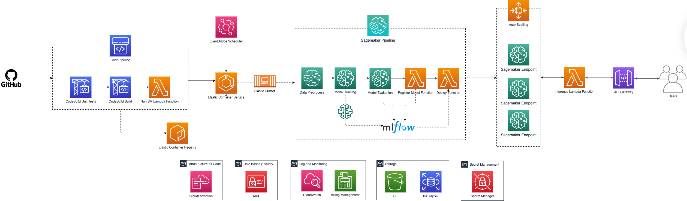
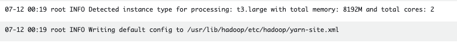
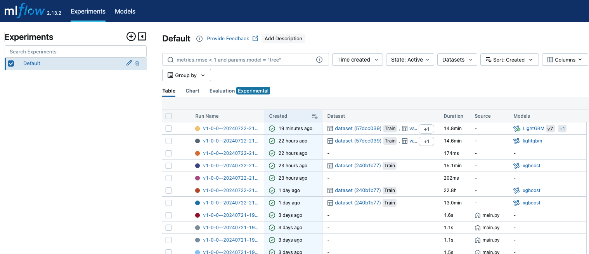

# Credit Fraud Detection — End-to-End MLOps on AWS

An end-to-end machine learning pipeline for credit card fraud detection that processes raw transactions from a configured S3 or RDS source to train and deploy a live auto-scaling inference endpoint, with CI/CD, model governance, and experiment tracking built in.



The project automates the training and deployment workflow on AWS: data is sourced from S3 or RDS, prepared with PySpark or scikit-learn, used to train XGBoost and LightGBM models inside Amazon SageMaker Pipelines, evaluated against a quality gate, registered in MLflow, and deployed to a SageMaker real-time endpoint through a canary release with automatic scaling. A CodePipeline-driven CI/CD flow ties it all together, and an EventBridge schedule retrains the model on a regular cadence.

> This project was built independently for study and portfolio purposes and
> reflects end-to-end ownership — from infrastructure definition to model
> serving — by its author. It is production-oriented in design, but adapting it
> to a real company's data, security/authentication, IAM, business metrics, and
> operational requirements would be a separate effort.

**Recognition.** This project was developed as part of Santander's internal
certification process, where its author received the "ML Engineering Expert"
designation — an internal recognition within the organization.

## What it solves

Fraud detection models are only as useful as the pipeline that keeps them accurate, current, and safely deployed. This project focuses on the operational side of model delivery rather than only the modeling step:

- **Reproducibility.** Every run is isolated with a unique execution id; scripts, processed data, artifacts, and metrics are persisted to S3.
- **Quality control.** A conditional step rejects models that fall below a minimum validation ROC-AUC before they can be deployed.
- **Safe rollout.** New models are deployed with a canary (blue/green) strategy and only replace live capacity once healthy.
- **Traceability.** Validation and test metrics, along with model versions, are tracked in MLflow.

## Key capabilities

- **Automated CI/CD.** Merges to the target branch trigger CodePipeline, which runs unit tests, builds and pushes a Docker image to ECR, and launches the pipeline on Fargate.
- **Distributed preprocessing.** PySpark jobs scale horizontally and derive Spark configuration automatically from the detected hardware; scikit-learn is supported as a lighter alternative.
- **Dual algorithm training.** XGBoost and LightGBM are both implemented behind a common strategy interface, selectable by configuration.
- **MLflow integration.** Training and evaluation metrics are logged to a managed MLflow tracking server; approved models are registered and comparable through the MLflow UI.
- **Governed deployment.** A SageMaker pipeline condition gates deployment on validation ROC-AUC; a Lambda step applies auto scaling and a canary update.
- **Serverless API.** API Gateway exposes the model through Lambda, with a health check route, a usage plan that meters and throttles requests, and a Lambda authorizer that authenticates callers against a shared secret.
- **Infrastructure as code.** The stack, including IAM roles and policies, is declared in CloudFormation and installed through scripts. The SageMaker domain and MLflow tracking server are configured manually as prerequisites.

## Technology stack

| Area | Technology |
| --- | --- |
| Pipeline orchestration | Amazon SageMaker Pipelines |
| Compute | AWS Fargate (ECS), SageMaker processing and training jobs |
| Data processing | Apache PySpark, scikit-learn |
| Training Service| Amazon Sagemaker |
| Supported Models | XGBoost, LightGBM |
| Experiment tracking | MLflow (managed on SageMaker) |
| CI/CD | AWS CodePipeline, AWS CodeBuild, GitHub (CodeStar connection) |
| Infrastructure as code | AWS CloudFormation |
| Model serving | SageMaker real-time endpoints, Application Auto Scaling, canary deployment |
| API | Amazon API Gateway, AWS Lambda |
| Scheduling | Amazon EventBridge Scheduler |
| Security | AWS IAM, AWS Secrets Manager, Lambda authorizer, API keys with usage plans |
| Observability | Amazon CloudWatch Logs |
| Language & tooling | Python 3.11, Docker, PyTest, ruff, setuptools |

## Architecture Overview

The system is organized into three phases, illustrated in the diagram above and detailed in the [architectural document](ARCHITECTURAL_PRESENTATION.md):

1. **Continuous integration.** CodePipeline runs unit tests and builds the container image, then a Lambda updates the ECS task definition and triggers the pipeline on Fargate.
2. **Model pipeline.** A SageMaker pipeline runs the compute-heavy steps: preprocessing, training, evaluation, model creation, registration, and deployment.
3. **Deployment.** The model is served from a SageMaker endpoint, scaled by target-tracking policies, and exposed through an API Gateway with a Lambda authorizer (an API key and usage plan additionally meter and throttle requests).

The preprocessing and training layers are the most illustrative of the design. PySpark preprocessing scales across a cluster:



Approved models are registered in MLflow alongside their metrics and can be compared through the MLflow UI:



For the full theory, design decisions, deployment plan, and configuration reference, see [ARCHITECTURAL_PRESENTATION.md](ARCHITECTURAL_PRESENTATION.md).

## Skills demonstrated

The project spans the training and deployment workflow and exercises a broad set of engineering disciplines. This section maps each discipline to where it is applied in the codebase.

| Skill area | Where it is applied |
| --- | --- |
| MLOps & pipeline orchestration | `credit_fraud/main.py` and `credit_fraud/pipeline/steps/` define the SageMaker Pipelines DAG, the metric-based condition gate, and per-step job builders. |
| Software design | A strategy pattern selects the preprocessing framework (`steps/preprocess.py`) and the training algorithm (`steps/train.py`); a shared context object centralizes configuration; abstract base classes define step and strategy contracts. |
| CI/CD | `buildspec.yml` and `testspec.yml` drive CodeBuild; image tags follow the package version in `pyproject.toml`. |
| Infrastructure as code | `cloudformation/templates/` declares the AWS resources (with the SageMaker domain and MLflow server configured as manual prerequisites), installed via `cloudformation/install.sh`. |
| Data engineering | `credit_fraud/pipeline/jobs/preprocess_pyspark.py` performs distributed preprocessing with Spark, automatic cluster sizing, and fitted scalers that avoid data leakage. |
| Model training & experimentation | `jobs/xgboost/train.py` and `jobs/lgbm/train.py` implement both algorithms with MLflow autologging and validation metrics. |
| Model evaluation & governance | `jobs/evaluate.py` computes ROC-AUC, balanced accuracy, and the confusion matrix on the validation set (driving the deployment gate) and the test set (final report), keeping the two roles distinct. |
| Model serving & deployment | `steps/deploy_endpoint.py` and the deploy Lambda apply canary updates and Application Auto Scaling target-tracking policies. |
| API design & security | `cloudformation/src/lambda/route_inference/` adapts requests to endpoint interfaces; a Lambda authorizer authenticates callers, while API keys, usage plans, and scoped IAM policies govern access. |
| Configuration & secrets | `config.yml` holds non-sensitive parameters; `.env` supplies environment-specific values; RDS credentials are read from AWS Secrets Manager. |
| Observability | Component logs flow to CloudWatch; MLflow surfaces experiments, runs, and model versions in one place. |

## Engineering scope

This project required making decisions across the entire stack rather than within a single framework. Design choices such as the AWS platform selection, the strategy pattern for interchangeable preprocessing and training frameworks, the environment-variable override mechanism for hyperparameters, and the conditional deployment gate each carry real trade-offs in cost, maintainability, and operational risk. The result is a system that favors clarity and reproducibility: configuration lives outside the code, every run is traceable, and infrastructure is reproducible from templates.

## Repository layout

```
cloudformation/   Infrastructure as Code templates and Lambda sources
credit_fraud/     SageMaker pipeline, step definitions, and job scripts
models/           Default hyperparameters for XGBoost and LightGBM
tests/            Unit tests run during CI
imgs/             Diagrams referenced by the documentation
```

## Getting started

The [architectural document](ARCHITECTURAL_PRESENTATION.md) covers prerequisites, the CloudFormation installation, and debugging in its implementation plan. In short: copy `.env.example` to `.env`, fill in the required values, install the stacks with `cloudformation/install.sh`, then merge to the repository to trigger the integration pipeline end to end.

> [!WARNING]
> The deployment provisions paid resources (for example, a minimum of two
> `ml.m4.xlarge` SageMaker endpoint instances and a managed MLflow server) that
> incur ongoing charges and are not removed by `cloudformation/uninstall.sh`.
> Review the cost and teardown section in the architectural document before
> deploying.

## Documentation

- [ARCHITECTURAL_PRESENTATION.md](ARCHITECTURAL_PRESENTATION.md) — architecture, design decisions, API reference, and configuration guide.
- [CONTRIBUTING.md](CONTRIBUTING.md) — contribution policy.
- [VENDORED_DEPENDENCIES.md](VENDORED_DEPENDENCIES.md) — bundled dependencies and their rationale.
- [THIRD_PARTY_NOTICES.md](THIRD_PARTY_NOTICES.md) — third-party component licenses.
- [LICENSE](LICENSE) — usage terms.
